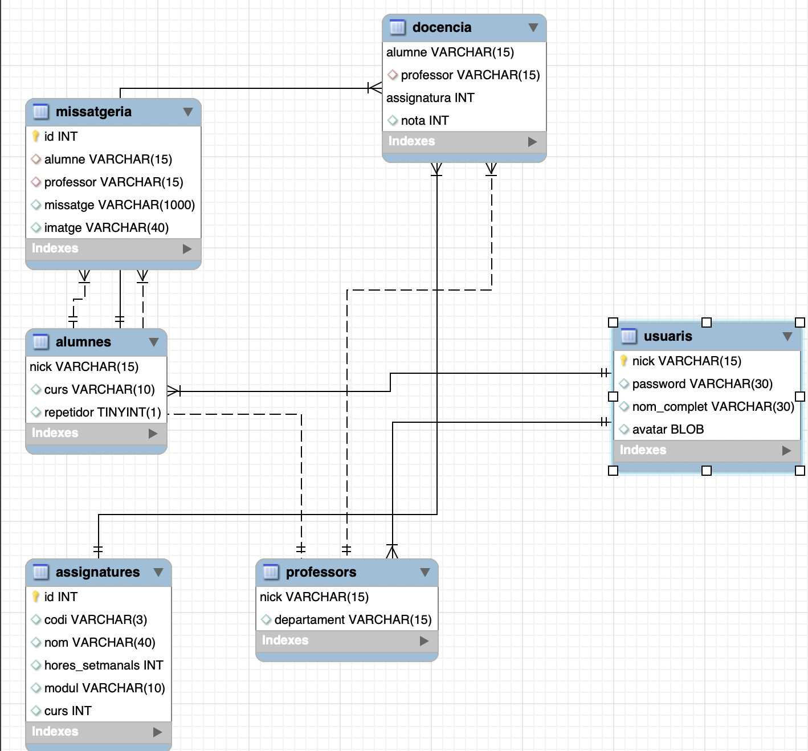

# Script sql

## E-R

Entitat-relació en enginyería inversa:

- Alumnes i professors és una especialització total(Tots els usuaris han de ser o professor o alumne) i disjunta(Un alumne no pot ser professor i viceversa).

- Docència és una relació ternaria en la que la parella d'alumne i assignatura NO es pot repetir, per evitar que més d'un professor impartisquen la mateixa assignatura al mateix alumne. Aquesta relació també té un atribut que és nota.

- Missatgería és una relació entre alumnes i professors on guardem els missatges i les imatges que es puguen enviar.
